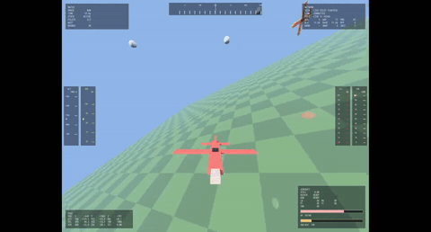
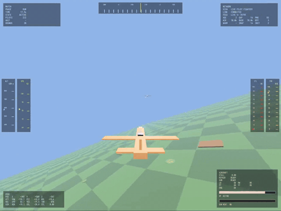

# dogfight-rl

A research-grade dogfight (air combat) simulation and deep reinforcement learning project: a Rust/Bevy simulation engine drives a Python DRL pipeline that trains autonomous fighter agents through PPO, behavioral cloning, DAgger, and self-play.

## Background & Motivation

Air combat maneuvering (ACM) is a classic benchmark for sequential decision-making: continuous control, partial observability, and sparse, safety-critical rewards. This project explores how far a self-trained agent can go in a high-fidelity 6-DOF flight simulation, from imitation of scripted teachers to fully self-play-driven policies — all in a single integrated codebase with contract-pinned observation/action schemas.

## Live Demo

The red fighter is the trained agent (RL policy). Two scenarios:

**Defensive maneuvering under tail attack** — agent's own view:


<video controls src="docs/demo-defense.mp4" width="100%"></video>

**Head-on engagement** — recorded from the opponent's (yellow fighter) view:


<video controls src="docs/demo-head-on.mp4" width="100%"></video>

## Features

- **6-DOF flight simulation** built on Rust + Bevy 0.18, with a pyo3 Python binding for tight RL-loop integration
- **69-dimensional contract-driven observation space** (37 fields: enemy + self relative geometry and kinematics in body frames, plus episode time), pinned by a versioned JSON policy contract with SHA-256 validation
- **Hybrid action space**: 4 continuous (throttle/pitch/roll/yaw) + 3 binary (brake/fire_gun/repair)
- **Multi-stage training curriculum**: behavioral cloning (BC) warm-start → PPO fine-tuning → DAgger rounds → self-play (model controls both fighters)
- **Composable truncation policy system** (time-limit, opening-shot window, tactical-advantage) and scene pool for curriculum evaluation
- **Full ML tooling**: dataset packing from recordings, observation normalizers, checkpoint architecture migration, live model piloting

## Tech Stack

- **Rust / Bevy 0.18** — simulation engine, physics, rendering, recording
- **pyo3 / maturin** — Python bindings bridging sim and training
- **PyTorch** — neural networks and PPO/BC/DAgger training
- **69-dim observation space**, hybrid continuous+binary action head (clipped-normal policy)
- Self-play and opponent pools (built-in AI variants + model)

## Quick Start

Build the Rust simulation engine:

```bash
cargo build --release
```

Inspect the PPO training entry point (module layout: `project_src/dfb_reinforcement_learning`):

```bash
PYTHONPATH=project_src python -m dfb_reinforcement_learning.train.train_ppo --help
```

## Results

Over a 1000-episode evaluation window, the trained agent achieves:

- **Enemy destruction rate: 0.78**
- **Self destruction rate: 0.42**

## Vibe Coding Notice

The core algorithms (observation/reward design, self-play rollout architecture, truncation policies) and the overall system architecture were designed by the author. Engineering implementation was accelerated with AI coding agents (Hermes, Codex, etc.). The Rust simulation engine and Python training pipeline are original work.

## License

MIT — see [LICENSE](LICENSE).
